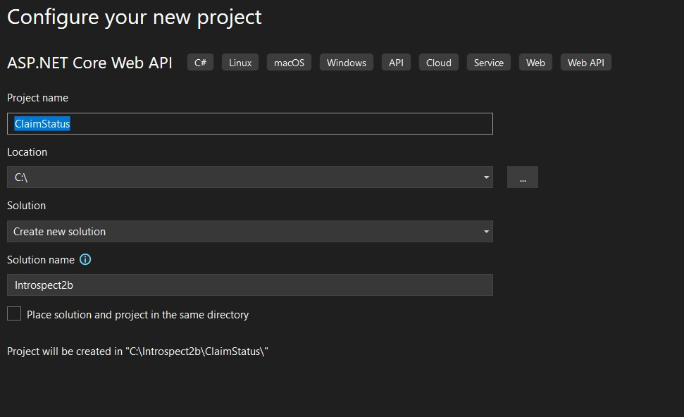

# General Overview

This document outlines the step-by-step implementation of the ClaimStatus API from scratch.
This include project creation, necessary implementations, and containerization using Docker.
For simplicity, the implementation use a mocks dataset for both endpoints as follow:

1. claims.json - contains a list of claims
1. notes.json - contains a list of notes related to claims

## Endpoints

1. GetClaimById - Retrieves a claim status by its unique identifier.
1. SummarizeClaimNotes - Provides a summary of all claim statuses integrated with OpenAI,

## Step-by-Step Implementation

### 1. Create a new ASP.NET Core Web API project from Visual Studio or using the .NET CLI.

- If using Visual Studio:
  - Open Visual Studio -> File -> New -> Project.
  - Select "ASP.NET Core Web Application" and click "Next".
    - Set the location and solution name
    - Name the soution `Itrospect1b`
    - Name the project ClaimStatus
 
    
    - Click "Next".
  - In the next dialog, ensure the next:
    - ".NET 8.0 (Long-term support)" is selected
    - Authentication: None
    - Ensure only HTTPS and Use controllers are checked for ASP.NET Core Web Api. We will add step by step the needed implementations
    
    
    - Click "Create".
---
### 2. Clenup the WetherForecast implementation

- Delete the `WeatherForecast.cs` file from the root of the project.
- Delete the `WeatherForecastController.cs` file from the `Controllers` folder.
---
### 3. Implement Claim controller thet contains GetClaim and SumarizeClaimNotes.

#### 3.1 Create the Controllers

- under the `Controllers` folder, create a new empty controller named `ClaimsController.cs`

#### 3.2 Create mocks for endpoins

- under Solution create a new folder named `mocks`
- add two json files named `claims.json` and `notes.json` with the next content that containt 5 claims and 7 Notes

**claims.json**
```json
{
  "Claims": [
    {
      "Id": 1,
      "PolicyNumber": "PN123456",
      "ClaimantName": "John Doe",
      "Status": "Pending Review",
      "DateFiled": "2023-10-01T10:15:30",
      "Amount": 1500.00
    },
    {
      "Id": 2,
      "PolicyNumber": "PN654321",
      "ClaimantName": "Jane Smith",
      "Status": "Approved",
      "DateFiled": "2023-09-15T14:45:20",
      "Amount": 2500.00
    },
    {
      "Id": 3,
      "PolicyNumber": "PN789012",
      "ClaimantName": "Alice Johnson",
      "Status": "Rejected",
      "DateFiled": "2023-08-20T08:30:45",
      "Amount": 3000.00
    },
    {
      "Id": 4,
      "PolicyNumber": "PN345678",
      "ClaimantName": "Bob Brown",
      "Status": "Approved",
      "DateFiled": "2023-07-10T16:20:10",
      "Amount": 1200.00
    },
    {
      "Id": 5,
      "PolicyNumber": "PN901234",
      "ClaimantName": "Charlie Davis",
      "Status": "Pending Review",
      "DateFiled": "2023-10-05T09:50:55",
      "Amount": 1800.00
    }
  ]
}
```
**notes.json**
```json
{
  "Notes": [
    {
      "Id": 1,
      "ClaimId": 1,
      "Content": "The claimant provided all necessary documents. The claim is under review.",
      "CreatedDate": "2023-10-02T09:15:30"
    },
    {
      "Id": 2,
      "ClaimId": 1,
      "Content": "Additional information requested from the claimant regarding the incident details.",
      "CreatedDate": "2023-10-03T14:45:20"
    },
    {
      "Id": 3,
      "ClaimId": 2,
      "Content": "The claim was submitted and is pending initial review.",
      "CreatedDate": "2023-09-15T10:00:00"
    },
    {
      "Id": 4,
      "ClaimId": 2,
      "Content": "Initial review completed. Additional documents requested from the claimant.",
      "CreatedDate": "2023-09-16T11:30:00"
    },
    {
      "Id": 5,
      "ClaimId": 2,
      "Content": "The claimant provided the requested documents. Verification process started.",
      "CreatedDate": "2023-09-18T14:20:00"
    },
    {
      "Id": 6,
      "ClaimId": 2,
      "Content": "Verification completed. Claim moved to final approval stage.",
      "CreatedDate": "2023-09-19T16:45:00"
    },
    {
      "Id": 7,
      "ClaimId": 2,
      "Content": "The claim was approved after verifying all required documents.",
      "CreatedDate": "2023-09-20T11:30:45"
    }
  ]
}
```

#### 3.3 Create the Models

- In the `ClaimStatus` project, create a new folder named `Models`.
- Inside the `Models` folder, create the next classes

  - `ClaimDetails.cs` which represents the details about a claim with the properties: Id, PolicyNumber, ClaimantName, Status, DateFiled, Amount.

  ```csharp
  namespace ClaimStatus.Models
  {
  	public class ClaimDetail
  	{
  		[JsonPropertyName("Id")]
  		public int Id { get; set; }

  		[JsonPropertyName("PolicyNumber")]
  		public string PolicyNumber { get; set; }

  		[JsonPropertyName("ClaimantName")]
  		public string ClaimantName { get; set; }

  		[JsonPropertyName("Status")]
  		public string Status { get; set; }

  		[JsonPropertyName("DateFiled")]
  		public string DateFiled { get; set; }

  		[JsonPropertyName("Amount")]
  		public decimal Amount { get; set; }
  	}
  }
  ```

  - `Claims.cs` which represents a collection of claims.`

  ```csharp
  namespace ClaimStatus.Models
  {
  	public class Claims
  	{
  		[JsonPropertyName("Claims")]
  		public List<ClaimDetail> ClaimsList { get; set; }
  	}
  }
  ```

  - 'Note.cs' which represents a note with the properties: Id, ClaimId, NoteText, CreatedAt.

  ```csharp
  namespace ClaimStatus.Models
  {
  	public class Note
  	{
  		[JsonPropertyName("Id")]
  		public int Id { get; set; }

  		[JsonPropertyName("ClaimId")]
  		public int ClaimId { get; set; }

  		[JsonPropertyName("NoteText")]
  		public string NoteText { get; set; }

  		[JsonPropertyName("CreatedAt")]
  		public DateTime CreatedAt { get; set; }
  	}
  }
  ```

  - `Notes.cs` which represents a collection of notes.

  ```csharp
  namespace ClaimStatus.Models
  {
  	public class Notes
  	{
  		[JsonPropertyName("Notes")]
  		public List<Note> NotesList { get; set; }
  	}
  }
  ```
---
### 4 Add UserSecrets for secure sensitive data

The implementation integrates OpenAI which will use sensitive informations to connect to OpenAI service.
For that reason we will use UserSecrets to keep sensitive info on local instead keeping them in code.
For this do the nest steps:

- Follow section `Run and Test the ClaimStatus API Locally Without Docker` available on the README.md documetation
- In the `ClaimStatus` project, open the `Program.cs` add to a new line after `var builder = WebApplication.CreateBuilder(args);` the next code:

```csharp
builder.Configuration.AddUserSecrets(Assembly.GetExecutingAssembly(), true);
```
---
### 5. Implement the ClaimsController

Open the `ClaimsController.cs` file and implement the GetClaimById and SummarizeClaimNotes endpoints as follow:

---
## GetClaimById Endpoint details

This endpoint retrieves a claim by its unique identifier. It reads from the `mocks/claims.json` file and returns the claim if found

`Endpoint URL:` `GET /api/claims/{id}`

`Parameters:`
- **Name:** `id` - The unique identifier of the claim to retrieve.
- **Type:** `integer`
- **Mandatory:** `Yes`

### Response Types

`200 OK` - If the claim is found, it returns a 200 OK response with the claim details.
```json
{
  "Id": 1,
  "PolicyNumber": "PN123456",
  "ClaimantName": "John Doe",
  "Status": "Pending Review",
  "DateFiled": "2023-10-01T10:15:30",
  "Amount": 1500
}
```

`400 Bad Request` - If there is an error reading the claims file, it returns a 400 Bad Request response.
```json
Invalid Id claim data provided.
```

`404 Not Found` - If the claim is not found, it returns a 404 Not Found response.
```
Claim with ID 15 not found.
```

`404 Not Found` - If the mock data is missing
```
Claims data set not found. Check if claim.json exist
```
---
## SummarizeClaimNotes Endpoint details

This endpoint provides a summary of all notes for a claim. It reads notes from the `mocks/notes.json` file and summarizes them using OpenAI's gpt-4o-mini model.
Implementation use the OpenAI so you need to add the `Azure.AI.OpenAI` package to the project using NuGet Package Manager or .NET CLI.

`Endpoint URL:` `POST /api/claims/1/summarize`
    
`Parameters:`
- **Name:** `Id` - The unique identifier of the claim to retrieve the recomandations based on all notes for Claim Id.
- **Type:** `Integer`
- **Mandatory:** `Yes`

### Response Types

`200 OK`- If the summary is successfully generated, it returns a 200 OK response with the summary text.
```json
{
  "claimId": 1,
  "originalNotes": "**Original Notes:**  \n1. The claimant provided all necessary documents. The claim is under review.  \n2. Additional information requested from the claimant regarding the incident details.",
  "summary": "**Summary:**  \nThe claimant has submitted all required documents, and the claim is currently under review. However, further information has been requested from the claimant about the incident specifics.",
  "recommendation": "**Recommendation:**  \nFollow up with the claimant to ensure the requested additional information is provided promptly. Set a reminder for the review process to ensure that it resumes immediately after receipt of the needed details."
}
```

`200 OK` - when Notes for a particular ClaimId does not exist in notes.json mock the response from OpenAI generates proper response
```json
{
  "claimId": 3,
  "originalNotes": "Original Notes: []",
  "summary": "Summary: There are no original notes provided to summarize.",
  "recommendation": "Recommendation: Please provide the claim notes for summarization and further recommendations."
}
```

`404 Not Found` - If the mock data is missing
```json
Notes data not found for Claim Id 1. Check if notes.exist to path: \mocks\notes.json
```

---
### 6. Add Swagger for API documentation and testing.

In the `ClaimStatus` project, add the `Swashbuckle.AspNetCore` NuGet package to enable Swagger.

- If using Visual Studio, right-click on the project, select "Manage NuGet Packages", and search for `Swashbuckle.AspNetCore`.
- If using .NET CLI, run:
  ```powershell
  dotnet add package Swashbuckle.AspNetCore
  ```

#### Replace code in Program.cs to configure Swagger and enable HTTPS redirection. Open `Program.cs` and replace the existing code with the following:

```csharp
using System.Reflection;

var builder = WebApplication.CreateBuilder(args);

// Add services to the container.
builder.Services.AddControllers();
builder.Configuration.AddUserSecrets(Assembly.GetExecutingAssembly(), true);

// Learn more about configuring Swagger/OpenAPI at https://aka.ms/aspnetcore/swashbuckle
builder.Services.AddEndpointsApiExplorer();
builder.Services.AddSwaggerGen();

var app = builder.Build();

app.UseSwagger();
app.UseSwaggerUI();

// Configure the HTTP request pipeline.

app.UseHttpsRedirection();

app.UseAuthorization();

app.MapControllers();

app.Run();

```
---
### 7. Application Insights Configuration
The implementation include Application Insights configuration which is a powerful monitoring service provided by Azure that helps you track the performance and usage of your applications. It provides insights into application health, performance metrics, and user behavior. 

To set up Application Insights, follow these steps:

1. In the `appsettings.json` file, add the Application Insights connection string under the `ApplicationInsights` section:
```json
"ApplicationInsights": {
  "ConnectionString": "your-connection-string-here"
}
```

2. In the `Program.cs` file, configure Application Insights by adding the following code:
```csharp
builder.Services.AddApplicationInsightsTelemetry(options =>
{
    options.ConnectionString = builder.Configuration["ApplicationInsights:ConnectionString"];
});
```

### 8. Test implementation on local machine without Docker

- Set `ClaimStatus` as the startup project in Visual Studio.
- Press `F5` to run the application. This will start the API and open Swagger UI in your default web browser.
  
- You can test the endpoints using Swagger UI or any API testing tool like Postman.

### 9. Check your Logs in Application Insights
- Navigate to the Azure portal and open your Application Insights resource.
- on Overview page you can see the basic metrics like server response time, failed requests, etc and should show some activity already:
  
---
---
## Containerization and run Claims Implementation Details

This chapter outlines the steps to containerize the ClaimStatus API using Docker. The process includes building the Docker image, creating a self-signed certificate for HTTPS, and running the container with the necessary environment variables.
Open a terminal and use th following steps will guide you through the containerization process:

##### 1. Build Immage

```powershell
docker build -f ClaimStatus/Dockerfile -t claimstatus:latest .
```

##### 2. Create Self-Signed Certificate

```powershell
dotnet dev-certs https -t -ep "$($env:USERPROFILE)\.aspnet\https\localdockercert.pfx" -p runapifromdocker
```

##### 3. Trust the certificate on your local machine

```powershell
dotnet dev-certs https --trust
```

##### 4. Run the Container

```powershell
docker run -it --rm -p 8030:8030 -p 8031:8031 `
  -e "ASPNETCORE_URLS=https://+:8031;http://+:8030" `
  -e "ASPNETCORE_HTTPS_PORTS=8031" `
  -e "ASPNETCORE_Kestrel__Certificates__Default__Path=/https/localdockercert.pfx" `
  -e "ASPNETCORE_Kestrel__Certificates__Default__Password=runapifromdocker" `
  -v "${HOME}\.aspnet\https\localdockercert.pfx:/https/localdockercert.pfx" `
  claimstatus:latest
```

### Accessing the ClaimStatus from Docker

You can access the Order Service API at the following URL:

```
https://localhost:8031/swagger/index.html
http://localhost:8030/swagger/index.html
```
