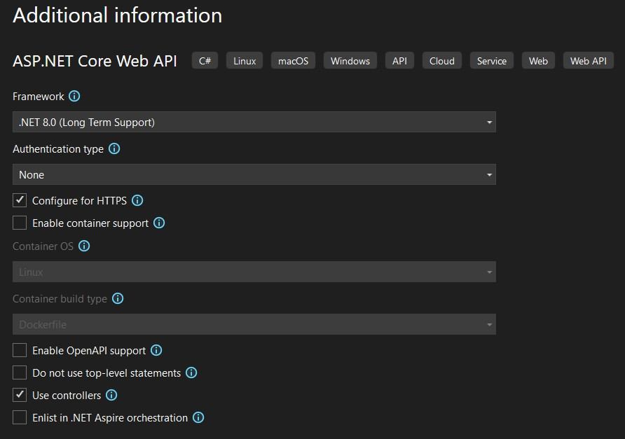

# General Overview 
This document outlines the step-by-step implementation of the ClaimStatus API, including project creation, necessary implementations, and containerization using Docker.
For simplicity, the implementation use a mocks dataset for both endpoints as follow:
1. mocks/claims.json - contains a list of claims
1. mocks/notes.json - contains a list of notes related to claims


## Endpoints
1. GetClaimById - Retrieves a claim status by its unique identifier.
1. SummarizeClaims - Provides a summary of all claim statuses integrated with OpenAI,  

## Step-by-Step Implementation
## Create the project
### 1. Create a new ASP.NET Core Web API project from Visual Studio or using the .NET CLI.
- If using Visual Studio:
	- Open Visual Studio -> File -> New -> Project.
	- Select "ASP.NET Core Web Application" and click "Next".
		- Set the location and solution name
		- Name the soution `Itrospect1b`
		- Name the project ClaimStatus
		
		- Click "Next".
	- In the next dialog, ensure the next:
	    - ".NET 8.0 (Long-term support)" is selected
		- Authentication: None
		- Ensure only HTTPS and Use controllers are checked for ASP.NET Core Web Api. We will add step by step the needed implementations
		
		- Click "Create".
### 2. Clenup the WetherForecast implementation
- Delete the `WeatherForecast.cs` file from the root of the project.
- Delete the `WeatherForecastController.cs` file from the `Controllers` folder.

### 3. Implement Claim controller thet contains GetClaim and SumarizeClaimNotes.

#### 3.1 Create the Controllers
- under the `Controllers` folder, create a new controller Empty controller named `ClaimsController.cs` 

#### 3.2 Create mocks for endpoins
- under Solution create a new folder named `mocks`
- add two json files with the next content that containt 5 claims and 7 Notes

#### 3.2 Create the Models
- In the `ClaimStatus` project, create a new folder named `Models`.
- Inside the `Models` folder, create the next classes
	- `ClaimDetails.cs` which represents the details about a claim with the properties: Id, PolicyNumber, ClaimantName, Status, DateFiled, Amount.
	
	```csharp
	namespace ClaimStatus.Models
	{
		public class ClaimDetail
		{
			[JsonPropertyName("Id")]
			public int Id { get; set; }

			[JsonPropertyName("PolicyNumber")]
			public string PolicyNumber { get; set; }

			[JsonPropertyName("ClaimantName")]
			public string ClaimantName { get; set; }

			[JsonPropertyName("Status")]
			public string Status { get; set; }

			[JsonPropertyName("DateFiled")]
			public string DateFiled { get; set; }

			[JsonPropertyName("Amount")]
			public decimal Amount { get; set; }
		}
	}
	```
    - `Claims.cs` which represents a collection of claims.`
	```csharp
	namespace ClaimStatus.Models
	{
		public class Claims
		{
			[JsonPropertyName("Claims")]
			public List<ClaimDetail> ClaimsList { get; set; }
		}
	}
	```
	- 'Note.cs' which represents a note with the properties: Id, ClaimId, NoteText, CreatedAt.
	```csharp
	namespace ClaimStatus.Models
	{
		public class Note
		{
			[JsonPropertyName("Id")]
			public int Id { get; set; }

			[JsonPropertyName("ClaimId")]
			public int ClaimId { get; set; }

			[JsonPropertyName("NoteText")]
			public string NoteText { get; set; }

			[JsonPropertyName("CreatedAt")]
			public DateTime CreatedAt { get; set; }
		}
	}
	```
	- `Notes.cs` which represents a collection of notes.
	```csharp
	namespace ClaimStatus.Models
	{
		public class Notes
		{
			[JsonPropertyName("Notes")]
			public List<Note> NotesList { get; set; }
		}
	}
	```  
### 4 Add user-sectets to Program.cs
- In the `ClaimStatus` project, open the `Program.cs` add to a new line after `var builder = WebApplication.CreateBuilder(args);` the next code:
```csharp
builder.Configuration.AddUserSecrets(Assembly.GetExecutingAssembly(), true);
```

### 5. Implement the ClaimsController
Open the `ClaimsController.cs` file and implement the GetClaimById and SummarizeClaims endpoints as follow:
#### GetClaimById: 
This endpoint retrieves a claim by its unique identifier. It reads from the `mocks/claims.json` file and returns the claim if found; 

##### Response Types
1. 200 OK - If the claim is found, it returns a 200 OK response with the claim details.
Request: `GET /api/claims/{id}`
Parameters: 
	Name: id - The unique identifier of the claim to retrieve.
	Tyepe: integer
    Mandatory: Yes
Response: 
```json
{
  "Id": 1,
  "PolicyNumber": "PN123456",
  "ClaimantName": "John Doe",
  "Status": "Pending Review",
  "DateFiled": "2023-10-01T10:15:30",
  "Amount": 1500
}
```
2. 400 Bad Request - If there is an error reading the claims file, it returns a 400 Bad Request response.
```json
Invalid Id claim data provided.
```

3. 404 Not Found - If the claim is not found, it returns a 404 Not Found response.
```
Claim with ID 15 not found.
```
4. 404 Not Found - If the mock data is missing
```
Claims data set not found. Check if claim.json exist
```
#### SummarizeClaims:
This endpoint provides a summary of all claim notes. It reads notes from the `mocks/notes.json` file and summarizes them using OpenAI's gpt-4o-mini model.
Implementation use the Open ai so package `Azure.AI.OpenAI` that you need to add to the project using NuGet Package Manager or .NET CLI.
##### Response Types
1. 200 OK - If the summary is successfully generated, it returns a 200 OK response with the summary text.
Request: `POST /api/claims/1/summarize`
Parameters: 
	Name: id - The unique identifier of the claim to retrieve.
	Tyepe: integer
    Mandatory: Yes
Response type: 
1. 200 Ok - if Notes exist for a particular ClamId
```

{
  "claimId": 1,
  "originalNotes": "**Original Notes:**  \n1. The claimant provided all necessary documents. The claim is under review.  \n2. Additional information requested from the claimant regarding the incident details.",
  "summary": "**Summary:**  \nThe claimant has submitted all required documents, and the claim is currently under review. However, further information has been requested from the claimant about the incident specifics.",
  "recommendation": "**Recommendation:**  \nFollow up with the claimant to ensure the requested additional information is provided promptly. Set a reminder for the review process to ensure that it resumes immediately after receipt of the needed details."
}
```
2. 200 OK - when Notes for a particular ClaimId does not exist
```
{
  "claimId": 3,
  "originalNotes": "Original Notes: []",
  "summary": "Summary: There are no original notes provided to summarize.",
  "recommendation": "Recommendation: Please provide the claim notes for summarization and further recommendations."
}
```
2. 500 Internal Server Error - If there is an error during the summary generation, it returns a 500 Internal Server Error response.
3. 400 Bad Request - If claim id is not valid. Should be a positive value
```
Invalid claim Id data provided.
```
4. 200 OK - 


### 6. Add Swagger for API documentation and testing.
   In the `OrderService` project, add the `Swashbuckle.AspNetCore` NuGet package to enable Swagger.
   - If using Visual Studio, right-click on the project, select "Manage NuGet Packages", and search for `Swashbuckle.AspNetCore`.
   - If using .NET CLI, run:
	 ```powershell
	 dotnet add package Swashbuckle.AspNetCore
	 ``` 
##### Replace code in Program.cs to configure Swagger and enable HTTPS redirection. Open `Program.cs` and replace the existing code with the following:

``` csharp
using System.Reflection;

var builder = WebApplication.CreateBuilder(args);

// Add services to the container.
builder.Services.AddControllers();
builder.Configuration.AddUserSecrets(Assembly.GetExecutingAssembly(), true);

// Learn more about configuring Swagger/OpenAPI at https://aka.ms/aspnetcore/swashbuckle
builder.Services.AddEndpointsApiExplorer();
builder.Services.AddSwaggerGen();

var app = builder.Build();

app.UseSwagger();
app.UseSwaggerUI();

// Configure the HTTP request pipeline.

app.UseHttpsRedirection();

app.UseAuthorization();

app.MapControllers();

app.Run();

```

### 7. Test implementation on local machine
- Set `ClaimStatus` as the startup project in Visual Studio.
- Press `F5` to run the application. This will start the API and open Swagger UI in your default web browser.

- You can test the endpoints using Swagger UI or any API testing tool like Postman.


## Containerization and run Claims without 
  
This chapter outlines the steps to containerize the ClaimStatus API using Docker. The process includes building the Docker image, creating a self-signed certificate for HTTPS, and running the container with the necessary environment variables.
Open a terminal under solution folder and navigate to the project directory (src/ClaimStatus). The following steps will guide you through the containerization process:

##### 1. Build Immage
```powershell
docker build -t claimstatus:latest .
```

##### 2. Create  Self-Signed Certificate
```powershell
dotnet dev-certs https -t -ep "%USERPROFILE%\.aspnet\https\productservice.pfx" -p runapifromdocker
```
##### 3. Trust the certificate on your local machine
```powershell
dotnet dev-certs https --trust
```

##### 4. Run the Container

```powershell
docker run -it --rm -p 8081:8081 `
  -e "ASPNETCORE_URLS=https://+:8081;http://+:8080" `
  -e "ASPNETCORE_HTTPS_PORTS=8081" `
  -e "ASPNETCORE_Kestrel__Certificates__Default__Path=/https/productservice.pfx" `
  -e "ASPNETCORE_Kestrel__Certificates__Default__Password=runapifromdocker" `
  -v "${HOME}\.aspnet\https\productservice.pfx:/https/productservice.pfx" `
  productservice
```

### Accessing the Order Service
You can access the Order Service API at the following URL:
```
https://localhost:8021/swagger/index.html
http://localhost:8020/swagger/index.html
```
## Local Run OrderService With Dapr
Open a terminal under solution folder and navigate to the OrderService project directory. 
Run the following command to start un the OrderService with Dapr:
```powershell
dapr run --app-id orderservice --app-port 5146 --components-path "../dapr/components" -- dotnet run
```
## Accessing the Product Service with Dapr
You can use Swagger UI to test the ProductService API endpoints. Open your web browser and navigate to:
```
https://localhost:5146/swagger/index.html
```

