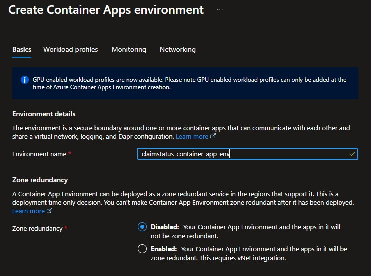

# Manual Deploymen of Resources in Azure
This document provides step-by-step instructions for manually deploying the related services In azure
The used servicis for ClaimStatus are:

- Azure Container Registry (ACR) 
- Azure Container Apps (ACA)
- Azure Log Analytics Workspace
- Azure Cntainer Environment 
- Api Management (APIM)

## 1. Deployment to Azure Container Registry (ACR) 
We will use Azure CLI for this objective.
##### 1.1 Login to azure
```
az login --tenant YOUR_TENANT_ID_
```
##### 1.2 Create the resource group
```
az group create --name introspect-2-b --location westeurope
```
##### 1.3. Create the ACR registry
- Check if your subscription is registered to use `Microsoft.ContainerRegistry` provider
	```
	az provider show --namespace Microsoft.ContainerRegistry --query "registrationState"
	```
- If the registrationState is `NotRegistered`, run the following command to register the provider:
	```
	az provider register --namespace Microsoft.ContainerRegistry
	```
- Wait registration to finish. You can check the result by running the command in step 1 again.
- Create the ACR registry
	```
	az acr create --resource-group introspect-2-b --name introspect2bacr --sku Basic
	```
- Enable the admin user account for the registry
	```
	az acr update -n introspect2bacr --admin-enabled true
	```
##### 1.4. Push an image to ACR
`a. Tag the Docker image for ClaimStatus`

- You need to ensure your local Docker immage exists before tagging it.

	If you have not built the Docker image yet, you can do so by running the following command solution folder (Introspect2b) and build image from there

	$\mathsf{\color{orange}Reason Explained:}$: We have external folders from project folders. I order to push to docker the external app context folder we need to buid the app from Introspect2b folder which is the solution folder

```
docker build -f ClaimStatus/Dockerfile -t claimstatus:latest .
```
- Then, tag the Docker image
```
docker tag claimstatus introspect2bacr.azurecr.io/claimservice:latest
```
- Push Push the Docker image to ACR for ClaimStatus
```
docker push introspect2bacr.azurecr.io/claimstatus:latest
```


# 2. Deploy ClaimStatus in ACA
1. Go to azure portal and create a new Azure Container App.
2. Select respurce group `introspect-2-b` 
3. Conteiner App Name: `claim-status-app`
4. Environment and Log Analytics Workspece are created via pipeline so will be already available



1. 5. In the Container tab
    - Select the container registry `introspect1bacr.azurecr.io`
	- Select image `claimstatus`
	- Select tag `latest`
	- Authentication type: `Secret`
	- Delpoyment Stack : `.NET`

	

6. Go to Ingress tab
	- Enable ingress
	- Acccept trafic from anyware
	- Target port: `8080`

	

7. Press Review and create, Then Create

8. Check the deployment status in the Azure Portal. 
It may take a few minutes for the Container App to be created and the container to be deployed.
After resource was deployed check your `productservice-app` Container App and make sure it is running:
- Go to the `productservice-app` resource in Azure Portal.
- Copy the URL from the Overview tab and replace `<productappURL>`in the link below
```
<productappURL>/swagger/index.html
```
Your link sould look like this:
```
https://productservice-app.jollypond-a6f1a425.westeurope.azurecontainerapps.io/swagger/index.html
```
- 


# Test communication between ProductService and OrderService using Dapr on Azure
You can test the communication between ProductService and OrderService using Dapr by invoking the endpoints defined in the ProductService API.
In Swagger UI, go to create endpoint and create a product.
### Example HTTP Requests for Create a Product
```http
POST https://<productappURL>/api/products
Content-Type: application/json

{
  "id": 100,
  "name": "Procuct check communication Azure",
  "price": 1,
  "stock": 3
}
```
1. The above request creates a new product in the ProductService.

2. After the product is created, the ProductService will publish an event to Dapr pub/sub, which can be consumed by the OrderService 
3. Check the logs frot both services to ensure that the event was published and consumed successfully.
   - In the `productservice-app` logs, you should see a message indicating that a product was created and an event was published.

	]

   - In the `orderservice-app` logs, you should see a message indicating that an event was received and processed.

	

## Documentation & learnings
For further reading and learning about Azure Container Apps, Dapr, and microservices architecture, you can refer to the following resources:
1. Container apps documentation: [Azure Container Apps Documentation](https://learn.microsoft.com/en-us/azure/container-apps/)
1. Microsoft Dapr documentation: [Dapr Documentation](https://learn.microsoft.com/en-us/azure/container-apps/dapr-overview)
1. Azure Container Apps Tutorial: [Azure Container Apps Tutorial](https://youtu.be/jfYJEcDOOkI?si=ePbJMgg2l6Ru-Zna)
1. Bicep Documentation: [Bicep Documentation](https://learn.microsoft.com/en-us/azure/azure-resource-manager/bicep/)


[Deploy Azure resources by using Bicep and Azure Pipelines](https://learn.microsoft.com/en-us/training/modules/authenticate-azure-deployment-pipeline-service-principals/1-introduction)