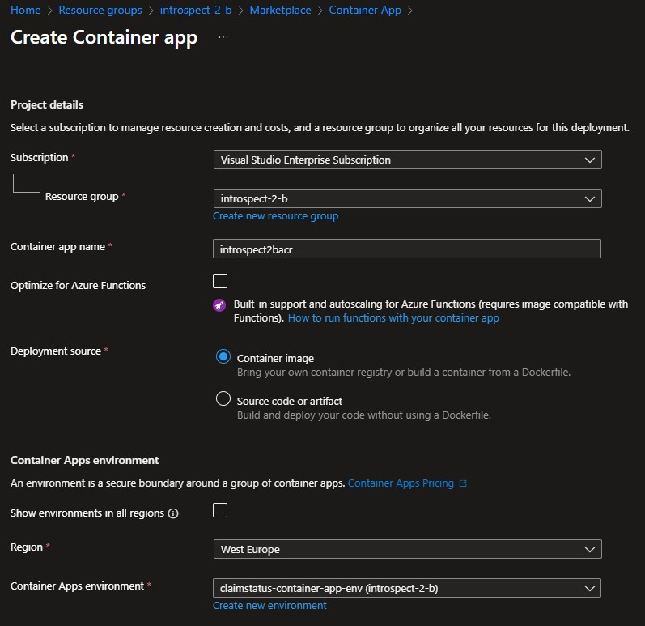
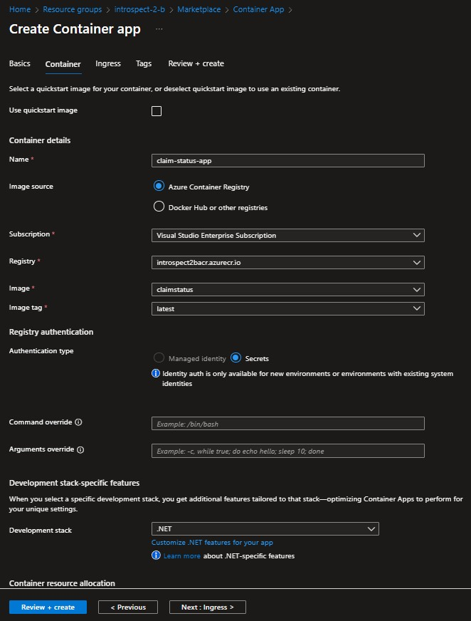
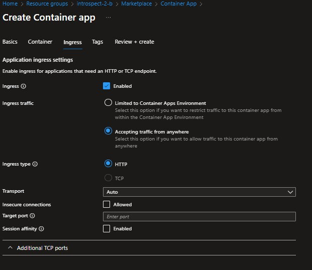

# Manual Deployment of Resources in Azure

This document provides step-by-step instructions for manually deploying the related services in Azure.
The services used for ClaimStatus are:

1. Azure Container Registry (ACR)
2. Azure Container Apps (ACA)
3. Azure Log Analytics Workspace
4. Azure Container Environment
5. Api Management (APIM)

---

## 1. Deployment to Azure Container Registry (ACR)

We will use Azure CLI for this objective.

ACR authentication uses **Entra ID (Azure AD) tokens** — no admin username or password is required or enabled.
`az acr login` exchanges your current `az login` session for a short-lived token automatically.

> If you are on a corporate network behind a TLS-inspection proxy and get certificate errors,
> see [CorporateCACertificateSetup.md](CorporateCACertificateSetup.md) before proceeding.

##### 1.1 Login to Azure

```bash
az login --tenant YOUR_TENANT_ID
```

##### 1.2 Create the resource group

```bash
az group create --name introspect-2-b --location westeurope
```

##### 1.3 Create the ACR registry

- Check if your subscription is registered to use the `Microsoft.ContainerRegistry` provider:

    ```bash
    az provider show --namespace Microsoft.ContainerRegistry --query "registrationState"
    ```

- If the result is `NotRegistered`, register it and wait for it to complete:

    ```bash
    az provider register --namespace Microsoft.ContainerRegistry
    ```

- Create the ACR registry:

    ```bash
    az acr create --resource-group introspect-2-b --name introspect2bacr --sku Basic
    ```

    The registry is created with `adminUserEnabled: false`. No static admin credentials exist.
    Authentication is handled exclusively through Entra ID role assignments (see next step).

##### 1.4 Assign ACR roles

Before pushing images you must grant your identity (and the pipeline service principal) the `AcrPush` role.
This is a one-time setup per identity.

- Get the ACR resource ID:

    ```bash
    ACR_ID=$(az acr show --name introspect2bacr --resource-group introspect-2-b --query id --output tsv)
    ```

- Assign `AcrPush` to **your own user account** (for manual pushes from your laptop):

    ```bash
    az role assignment create \
      --assignee $(az ad signed-in-user show --query id --output tsv) \
      --role AcrPush \
      --scope $ACR_ID
    ```

- Assign `AcrPush` to the **pipeline service principal** (for CI/CD pushes from Azure DevOps).
  Find the Application (client) ID in Azure DevOps under
  **Project Settings → Service connections → azure-subscription → Manage**:

    ```bash
    az role assignment create \
      --assignee <appId-from-service-connection> \
      --role AcrPush \
      --scope $ACR_ID
    ```

##### 1.5 Push an image to ACR

- Build the Docker image from the solution folder (`Introspect2b`).
  Building from the solution root is required because the Dockerfile references files outside the `ClaimStatus/` folder:

    ```bash
    docker build -f ClaimStatus/Dockerfile -t claimstatus:latest .
    ```

- Tag the image for ACR:

    ```bash
    docker tag claimstatus introspect2bacr.azurecr.io/claimstatus:latest
    ```

- Login to ACR using your Entra ID token:

    ```bash
    az acr login --name introspect2bacr
    ```

    This command uses your active `az login` session — no password prompt.

- Push the image:

    ```bash
    docker push introspect2bacr.azurecr.io/claimstatus:latest
    ```

---

## 2. Deploy ClaimStatus in ACA

1. Go to the Azure Portal and create a new Azure Container App.
2. Select resource group `introspect-2-b`.
3. Container App Name: `claim-status-app`.
4. Environment and Log Analytics Workspace are created via pipeline so will already be available.
   In case you need to create new ones:
    - Container App Environment: `claimstatus-container-app-env`
    - Log Analytics Workspace: `workspace-intospect2b-logs`
    - Location: `West Europe`

   

5. In the **Container** tab:
    - Select the container registry `introspect2bacr.azurecr.io`
    - Select image `claimstatus`
    - Select tag `latest`
    - Authentication type: `Admin Credentials` — **change this to `Managed Identity`** once a managed identity is configured on the ACA resource, to stay consistent with the no-static-credentials approach used for ACR
    - Deployment Stack: `.NET`

   

6. In the **Ingress** tab:
    - Enable ingress
    - Accept traffic from anywhere
    - Target port: `8080`

   

7. Press **Review and create**, then **Create**.

8. Check the deployment status in the Azure Portal.
   It may take a few minutes for the Container App to be created and the container to be deployed.
   After the resource is deployed, check your `claim-status-app` Container App and make sure it is running:

    - Go to the `claim-status-app` resource in Azure Portal.
    - Copy the URL from the Overview tab and replace `<claimstatusURL>` in the link below:

    ```
    <claimstatusURL>/swagger/index.html
    ```

    Your link should look like this:

    ```
    https://claim-status-app.delightfulmoss-58bb48c4.westeurope.azurecontainerapps.io/swagger/index.html
    ```

    - Open the link in your browser to access the Swagger UI for the ClaimStatus API.
