# General considerations

Deploy a Claim Status API in Azure Container Apps (ACA) by API Management
(APIM). Implement: GET /claims/{id} (status) and POST /claims/{id}/summarize (calls Azure
OpenAI to return a summary from mock notes). Secure and automate via Azure DevOps
CI/CD with image scanning and enable observability.

# Architecture Overview

This architecture implements the deployment of a Claim Status API within Azure Container Apps (ACA), 
with external access managed via Azure API Management (APIM). The API surface comprises two primary endpoints: 
- GET /claims/{id} for claim status retrieval 
- POST /claims/{id}/summarize for generating claim note summaries leveraging Azure OpenAI.

End-to-end automation is achieved through Azure DevOps CI/CD pipelines, orchestrating build, test, and deployment workflows. 

Security posture is strengthened by integrating container image scanning into the pipeline, while comprehensive observability is provided through Azure Monitor and Application Insights.

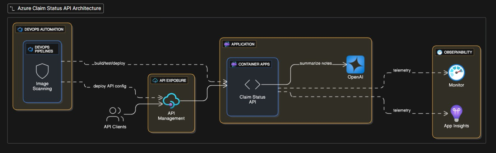


# Introspect1B Solution overview

### Project Structure

```
Introspect2b					# Solution folder
├── ClaimStatus (Project)			# Main project containing the API implementation
│   ├── Controllers				# Contains API controllers for handling HTTP requests
│   │   └── ClaimsController.cs
│   ├── Models					# Defines data models used in the application
│   │   ├── ClaimDetail.cs
│   │   ├── Claims.cs
│   │   ├── Note.cs
│   │   └── Notes.cs
│   ├── Documentation				# Includes implementation guides and related images
│   │   ├── StepByStepImplementation.md
│   │   └── Images
│   ├── Dockerfile				# Dockerfile for containerizing the application
│   ├── ClaimStatus.csproj			# Project file defining dependencies and configurations
│   ├── Program.cs				# Entry point of the application
│   └── appsettings.json (optional)		# Configuration file for application settings
├── mocks					# Contains mock data for testing the API
│   ├── claims.json
│   └── notes.json
├── pipelines					# Stores CI/CD pipeline configurations
│   └── azure-pipelines.yml
├── iac						# Infrastructure as Code templates for resource provisioning
│   ├── acr-deploy.bicep
|	├── log-analytics-workspace-def.bicep
|	├── container-environment-def.bicep
|	├── aca-deploy.bicep
├── scans					# Stores security scan results or related artifacts
│   └── defender-findings.png
├── observability				# Resources for monitoring and observability
│   ├── queries.kql
│   └── sample-screenshots
│       └── observability-example.png
├── docker-compose.yaml		# Docker Compose file for building and running containers
├── .env			# Environment variable file for secrets and configuration used by Docker Compose
└── README.md			# Documentation for the solution
```

- <span style="color:green"><b>TBRemovedLATER - OK ✅</b></span> - ClaimStatus/ — service source + Dockerfile.
- <span style="color:green"><b>TBRemovedLATER - OK ✅</b></span> - mocks/claims.json, mocks/notes.json (5–8 claim records; 3–4 notes blobs).
- <span style="color:red"><b>TBRemovedLATER - NOT Started ❗️</b></span> apim/ — APIM policy files or export.
- <span style="color:green"><b>TBRemovedLATER - OK ✅</b></span>  iac/ — Bicep/Terraform templates.
- <span style="color:green"><b>TBRemovedLATER - OK ✅</b></span>- pipelines/azure-pipelines.yml — Azure DevOps pipeline.
- <span style="color:red"><b>TBRemovedLATER - NOT Started ❗️</b></span> scans/ — link/screenshots to Defender findings
- <span style="color:green"><b>TBRemovedLATER - OK ✅</b></span>  observability/ — saved KQL queries and sample screenshots.
- <span style="color:orange"><b>TBRemovedLATER - IP 🖊️ </b></span> - README.md — instructions, GenAI prompts used, how to run/tests.

---

---

# ClaimStatus API Documentation

This document provides an overview of the ClaimStatus API which is a asp.net core web api application.
The API is designed to manage and track the status of claims within a system.
It allows users to retrieve claim statuses by their unique identifiers and provides a summary of all claim statuses integrated with OpenAI for enhanced insights.

For more details about implementation steps, and Testing please refer to the [ClaimStatus API Documentation](ClaimStatus/Documentation/StepByStepImplementation.md).

---

---

# Local setup considerations

## Prerequisites

1. [Docker](https://docs.docker.com/desktop/) installed and running on your machine.
2. [Azure CLI](https://learn.microsoft.com/en-us/cli/azure/install-azure-cli) installed on your machine.
3. Visual Studio 2022 or later with .NET Core SDK installed. You can download it from [Visual Studio Downloads](https://visualstudio.microsoft.com/downloads/).
4. An Azure subscription. If you don't have one, you can create a free account at [Azure Free Account](https://azure.microsoft.com/en-us/free/).
5. An Azure OpenAI resource. You can create one with <b> `Option 1: Allow all networks` </b>by following the instructions at [Create an Azure OpenAI resource](https://learn.microsoft.com/en-us/azure/ai-foundry/openai/how-to/create-resource?pivots=web-portal).

   ❗️ $\color{red}{Important}$: Make sure to note down the endpoint URL and API key for later use.

---

## Run and Test the ClaimStatus API Locally Without Docker

ClaimStatus API is a simple ASP.NET Core Web API application that provides endpoints to get claim status and summarize claim notes using Azure OpenAI.
It provide a secure configuration using user-secrets for local development.

1. Setup user-secrets:

   - right-click on the `ClaimStatus` project in Visual Studio and select `Manage User Secrets`.
   - This will open a `secrets.json` file. Add your Azure OpenAI API key and endpoint in the following format:

   ```json
   {
     "OpenAIConfig": {
       "Endpoint:": "replace with YOUR-OPENAI_ENDPOINTURL",
       "DeploymentName": "replace with your OpenAI deployment name created at Preresuisites point 5 ",
       "ApiKey": "replace with YOUR-OPENAI-APIKey"
   }
   ```

2. Run the ClaimStatus API:
   - Set `ClaimStatus` as the startup project in Visual Studio.
   - Press `F5` to run the application. This will start the API and open Swagger UI in your default web browser.
   - You can test the endpoints using Swagger UI or any API testing tool like Postman.

\(\mathsf{\color{lime}Remark:}\): For details about endpoints parameters and responses follow the the documentation [ClaimStatus API Documentation](ClaimStatus/Documentation/StepByStepImplementation.md)

---

## Run and Test the Solution from Docker on Local machine

1. Open .env file from source folder and and update your configuration as is mentioned

2. Open a terminal under solution folder run docker compose up command to build and run the microservices in Docker containers:

   ```powershell
   docker compose up --build
   ```

   This command builds the Docker images for both ProductService and OrderService and starts the containers.
   Your terminal should look like in immage below:

   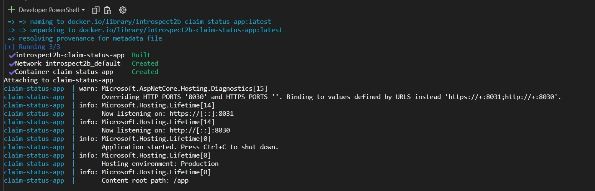

3. Open a browser and navigate to the following URLs to access the Swagger UI for ClaimStatus API and test that both HTTPS and HTTP are accesible and running

   For HTTPS: [https://localhost:7238/swagger/index.html](https://localhost:7238/swagger/index.html)

   For HTTP: [http://localhost:5261/swagger/index.html](http://localhost:5261/swagger/index.html)

   Your should have the swagger endpoints for ClaimStatus API visibe in browser like in immages below:

   **HTTPS port 7238**
   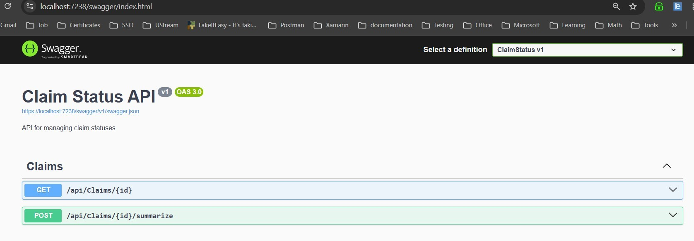

   **HTTP port 5261**
   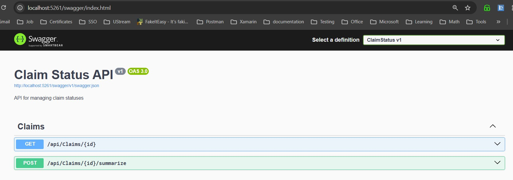

4. Test endpoints
   \(\mathsf{\color{lime}Remark 1:}\): Use HTTPS for testing or comment UseHttpRedirection in Program.cs to test over HTTP

   \(\mathsf{\color{lime}Remark 2:}\): For details about endpoints parameters and responses follow the the documentation ClaimStatus API Documentation

---

---

# Automation Overview

This section provides details about the implemented CI/CD pipeline and infrastructure as code (IaC) templates to automate the deployment process of the ClaimStatus API.

## Pipleline and IaC Overview

The implementation contain the pipeline and infrastructure as code (IaC) templates to automate the deployment process.
The pipeline is defined in the `pipelines/azure-pipelines.yml` file and uses Bicep templates located in the `iac/` folder.

$\mathsf{\color{lime}Remark 1:}$: For an easier maintainace and better understanding, each resource is defined in a separated Bicep file and also deployment of each resource is in a separated job in the pipeline definition.

$\mathsf{\color{lime}Remark 2:}$: In real project the pipeline dedicated for code buld and resources deployment are separatesd. In this demo project, for simplicity, they are in the same pipeline.

## Pipeline stages

### Stage 1: **Deploy Mandatory Resources**:

At this stage resources are checked and deployed if not exist.
Resources are defined in the Bicep template and pileline uses them to deploy the resources in Azure.

The resources deployed bicep files are:

- Azure Container Registry (ACR),
- Azure Log Analytics,
- Azure Container Environment

Resources not included in pipeline:

1. Azure OpenAI - already manually deployed to run the solution on local (reffer README.md documentation)
1. Because of short timeline of develop this POC:
	- Azure Container Apps (ACA),
	- Azure API Management (APIM),
	- Azure Application Insights.

### Stage2: **Build and Push Docker Images to ACR**:

Perform the next:
1. Build the Docker images for the ClaimStatus API
1. Scan the images for vulnerabilities using Trivy and fail the build if `Critical` or `High` vulnerabilities are found.
1. In case of no vulnerabilities found push the images to Azure Container Registry (ACR) Otherwise fail the build.

Here is an example of the Trivy scan result:
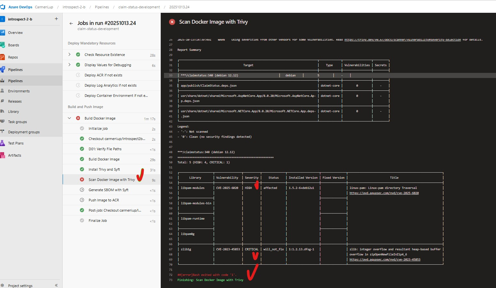

---

---

# Deployment Process Considerations

The deployment process involves several steps to ensure that the ClaimStatus API is properly deployed and configured in Azure Container Apps (ACA).

## Description

The deployment process involves the following steps:

1. **Connect to Github Repository**: The source code for the ClaimStatus is hosted in a GitHub repository, which is connected to Azure DevOps for continuous integration and deployment (CI/CD).
1. **Build and Push Docker Images to ACR**: The solution images is built and pushed to an Azure Container Registry (ACR) for secure storage and management.
1. **Deploy to Azure Container Apps (ACA)**: The ClaimStatus API is deployed to Azure Container Apps (ACA) using Bicep templates for infrastructure as code (IaC).
1. **Set Up CI/CD Pipeline in Azure DevOps**: An automated CI/CD pipeline is created in Azure DevOps to streamline the build, test, and deployment processes.

Below are the detailed steps for the deployment process.

## Prerequisites

Few prerequisites are needed before starting the deployment process:
1. **Azure Portal**: Ensure you create create a resource group named `introspect-2-b` in West Europe region to host the resources.
2. **Azure DevOps Setup**: Setup described in the next section
3. **GitHub Repository**: The source code for the ClaimStatus should be hosted in a GitHub repository.

## 2. Azure DevOps Setup

In order to automate the deployment process, we will set up a CI/CD pipeline in Azure DevOps.

### 2.1 Create a new project in Azure DevOps

- Go to your Azure DevOps organization and click on `New Project`.
- Enter `introspect-2-b` name for your project  and click `Create`.

Documentation link: [Create a project](https://learn.microsoft.com/en-us/azure/devops/organizations/projects/create-project?view=azure-devops&tabs=preview-page)

### 2.2. Setup GitHub connection

- In your Azure DevOps project, navigate to `Project Settings` -> `Service connections`.
- Click on `New service connection` and select `GitHub`.
- Authenticate with your GitHub account and authorize Azure DevOps to access your repositories.

Documentation link: [Connect to GitHub](https://learn.microsoft.com/en-us/azure/devops/boards/github/connect-to-github?view=azure-devops)

### 2.3 Create Azure Resource Manager connection

This will ensure that Azure DevOps can deploy resources to your Azure subscription.

- In your Azure DevOps project, navigate to `Project Settings` -> `Service connections`.
- Click on `New service connection` and select `Azure Resource Manager`.
- Connect using the service principal (automatic) option and follow the prompts to authenticate and authorize Azure DevOps.
- Select the subscription and resource group `introspect-2-b` created on step 2.2.
- Use `azure-connection` for service connection name and save it.

Documentation link [Service connections](https://learn.microsoft.com/en-us/azure/devops/pipelines/library/service-endpoints?view=azure-devops&tabs=yaml)

### 2.4. Create secure connection to Azure Container Registry (ACR)

- In your Azure DevOps project, navigate to `Project Settings` -> `Service connections`.
- Click on `New service connection` and select `Docker Registry`.
- Select `Azure Container Registry` as the registry type.
- Select the subscription and the ACR instance `introspect2bacr` created on step 2.3.
- Use `acr-connection` for service connection name and save it.

# 3. Deploy resource in Azure via automation

This section provides instructions for deploying the ClaimStatus to Azure Container Apps (ACA) using azure pipelines.

### 3.1 Create a new pipeline in Azure DevOps

- Go to your Azure DevOps project and navigate to the Pipelines section.
- Click on `New Pipeline` and select `Azure Repos Git` as the source.
-  Repository is in Github so select GitHub and authenticate if needed.
- Select your repository containing the microservices code.
- Choose `Select an existing YAML file` and select the path to the pipeline in the repo which is `/pipelines/azure-pipelines.yml` like in immage below:

- press Continue button
  Now you sould be able to see the azure-pypeline.yaml definition

  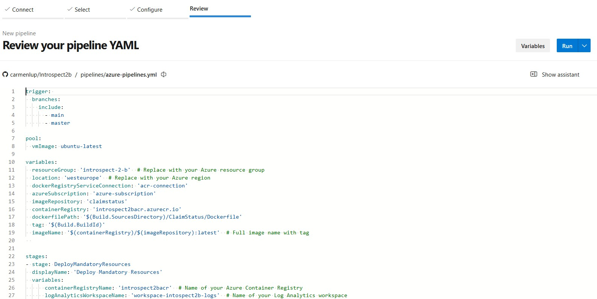
- press Run button to create and run the pipeline. Wait until pipleline is finish

  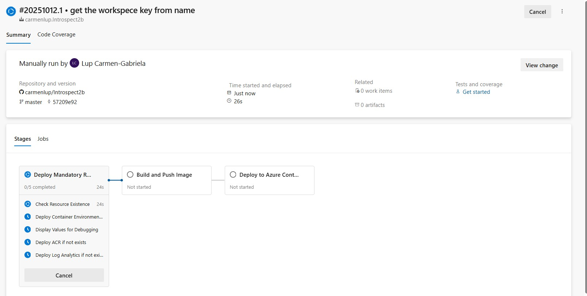

### 3.2 Check Deployed resources
After pipeline runs you should have the next respurces created in cloud:
- Azure Container Registry (ACR),
- Azure Log Analytics,
- Azure Container Environment

### 3.2 Manual Deploy
As is mentioned in the section `Pipleline and IaC Overview` Azure Container Registy is not included in pipeline deployment.
To deploy the ACR follow the documentation [Manual Deployment In Azure](Documentation/ManualDeployResourcesInAzure.md) and run the pipeline again to build the code and push to ACR.

The documentation provide also the deployment of ACR and ensure the minimal infrastructure to have the ClamStatus API up and run.

---
---
# 4. Establish connectivity with docker after deployment
After deployment in Azure conectivity between OpenAI and ACA must be configured in order to run the POST endpoint.
### Secrets Configuration for OpenAi in Azure ACA
- In ACA, go to `Security` -> `Secrets` and create the next secrets:
	- Name: `openaiconfig-endpoint`, Value: `(your OpenAi endpoint)`
	- Name: `openaiconfig-deploymentname`, Value: `(your OpenAi deployment name)`
	- Name: `openaiconfig-apikey`, Value: `(your OpenAi API key)`
- In `Containers` -> `Environment variables`:
	- Name: `OpenAiConfig__Endpoint`, Source: `Reference a secret`, Value: `openaiconfig-endpoint`
	- Name: `OpenAiConfig__DeploymentName`, Source: `Reference a secret`, Value: `openaiconfig-deploymentname`
	- Name: `OpenAiConfig__ApiKey`, Source: `Reference a secret`, Value: `openaiconfig-apikey`
- Save and restart your app.

### Test the endpoints
- Go to the `claim-status-app` resource in Azure Portal.
- Open the API in a new tab
	- Copy the URL from the Overview tab and replace `<calimstatusURL>`in the link below
	```
	<calimstatusURL>/swagger/index.html
	```
	Your link sould look like this:
	```
	https://claim-status-app.delightfulmoss-58bb48c4.westeurope.azurecontainerapps.io/swagger/index.html
	```

- In the preview tab select Log Stream tab on ACA to live stream and see the result. Initial log stream should look loke this:
- Execute both `claim` and `sumarize` APIs `id = 1`. You should see the logs in Log Stream

	ACA Logs for `/api/Claims/1`
	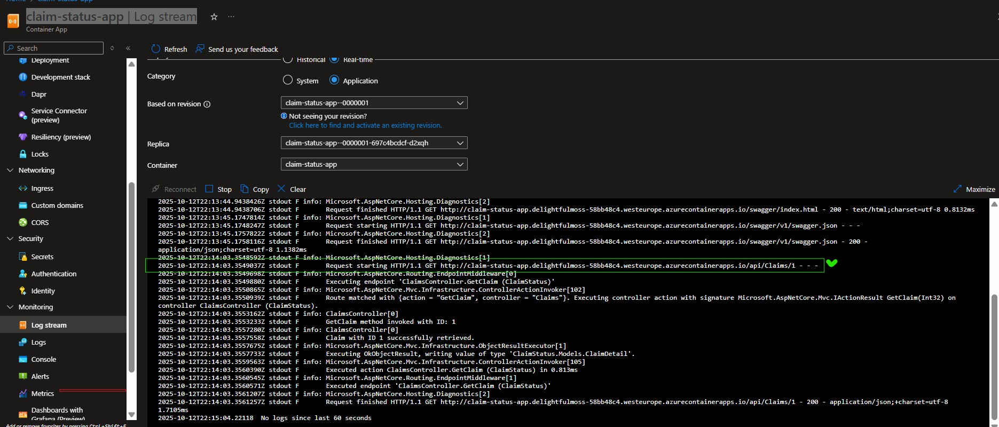

	ACA Logs for `/api/Claims/1/summarize`
	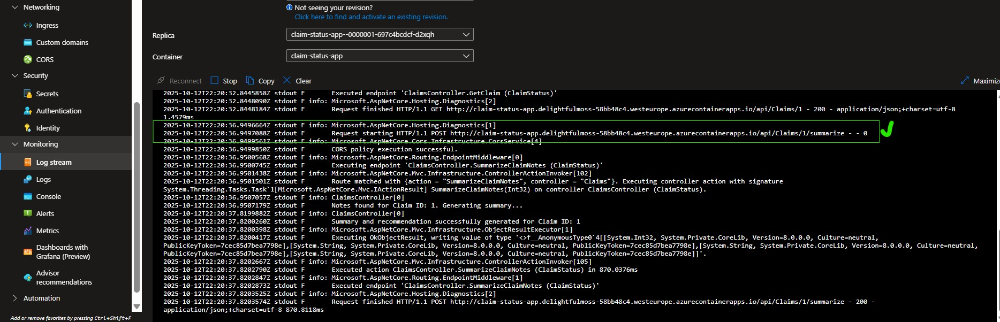

---
---
# 5 Monitoring ACA with Log Analytics and Application Insights
ACA has already Log Analytics workspace configured and connected to ACA.
To have more insights and monitoring capabilities Application Insights must be configured and connected to ACA.
Log Analytics will be used for infrastructure monitoring and Application Insights for application monitoring.

### 5.1 Create Application Insights resource
- In Azure Portal create a new Application Insights resource in the same resource group `introspect-2-b` and West Europe region.
- Set the name to `appins-claimstatus-resource`
- Choose the Log Analytics workspace created by pipeline `workspace-intospect2b-logs` in the same resource group.
- Create the resource.
- Execute few calls to the API to generate some logs.
- Check the [ClaimStatus API Documentation](ClaimStatus/Documentation/StepByStepImplementation.md) for more details about Application Insights configuration and usage.

### 5.2 Use KUSTO query Analytics to query logs from ACA and Application Insights
Monitoring and observability is a key aspect of any application deployment. 
All Log Services provide powerful querying capabilities to analyze and visualize logs namely Kusto Query Language (KQL).
Kusto provides a rich set of operators and functions to filter, aggregate, and transform log data.

Also provides predefined queries and dashboards to help you get started quickly.

Also you can create custom queries.

Can be lounched from both ACA and Application Insights resources from `Monitoring` -> `Logs`

#### Example of predifined KQL query to see the logs from both ACA and Application Insights:
- In ACA go to `Settings` -> `Monitoring` -> Logs
- filter for `Operations performance`
- Run the query to see the logs from ACA:
You will see the logs like in immage below:
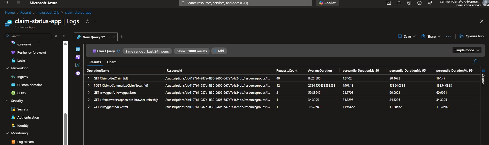

#### Example of custom KQL query to see the logs from Application Insights:

In observability folder you can find the next custom KQL queries in `queries.kql` file:
1. `Get all traces and requests from the last 1 hour ordered by time desc`
1. `Check all 404 errors in the last 24 hours ordered by time desc`
1. `Check all 500 errors in the last 24 hours ordered by time desc`
1. `Check all failed requests in the last 24 hours ordered by time desc`

Execute them in ACA Monitoring Logs or in Application Insights Logs to see the result

---
---

# 5. Setup APIM and connect to ACA
This section provides instructions for setting up Azure API Management (APIM) to expose the ClaimStatus API deployed in Azure Container Apps (ACA).
## Prerequisites
1. An Azure subscription with the necessary permissions to create and manage resources.
1. An existing Azure Container App (ACA) with the ClaimStatus API deployed and running.
1. The URL of the ClaimStatus API in ACA. You can find this in the Overview tab of your ACA resource in the Azure portal.
1. An existing resource group named `introspect-2-b` in West Europe region to host the APIM instance.
1. An existing APIM instance. If you don't have one, you can create it by following the instructions in the [APIM documentation](https://learn.microsoft.com/en-us/azure/api-management/get-started-create-service-instance).
1. Azure DevOps setup as described in the [Azure DevOps Setup](#2-azure-devops-setup) section.

## 5.1 Steps to set up APIM and connect to ACA
1. **Create APIM Instance:** Follow the instructions in the [APIM documentation](https://learn.microsoft.com/en-us/azure/api-management/get-started-create-service-instance) to create an APIM instance in the `introspect-2-b` resource group.
1. **Import ACA**: Follow the instructions [Import an Azure container app as an API](https://learn.microsoft.com/en-us/azure/api-management/import-container-app-with-oas)

## 5.2 Test the APi's via APIM
- Go to the APIM instance in the Azure portal.
- Navigate to the `APIs` section and select the ClaimStatus API.
- Click on the `Test` tab to test the API endpoints.
- Test the `GET /api/Claims/{Id}` endpoint by providing a valid claim ID.
- Test the `POST /api/Claims/{Id}/summarize` endpoint by providing a valid claim ID.
- Verify that the responses are as expected.

`GET /api/Claims/{Id}`
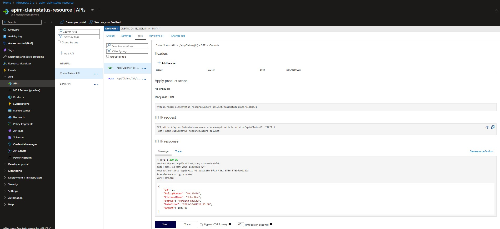
`POST /api/Claims/{Id}/summarize`
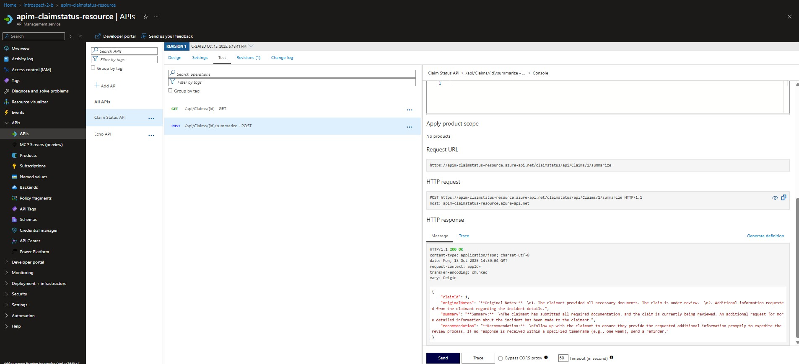

## Documentation & learnings

For further reading and learning about Azure Container Apps, Dapr, and microservices architecture, you can refer to the following resources:

1. Container apps documentation: [Azure Container Apps Documentation](https://learn.microsoft.com/en-us/azure/container-apps/)
1. Azure Container Apps Tutorial: [Azure Container Apps Tutorial](https://youtu.be/jfYJEcDOOkI?si=ePbJMgg2l6Ru-Zna)
1. Bicep Documentation: [Bicep Documentation](https://learn.microsoft.com/en-us/azure/azure-resource-manager/bicep/)
1. Bicep learning path [Deploy Azure resources by using Bicep and Azure Pipelines](https://learn.microsoft.com/en-us/training/paths/bicep-azure-pipelines/)
1. Log Analytics Tutorial: [Log Analytics Tutorial](https://learn.microsoft.com/en-us/azure/azure-monitor/logs/log-analytics-tutorial)
1. ARM Template Reference: [ARM Template Reference](https://learn.microsoft.com/en-us/azure/templates/)
2. Azure CLI Reference: [Azure CLI Reference](https://learn.microsoft.com/en-us/cli/azure/reference-index?view=azure-cli-latest)
1. Kusto Query Language (KQL) Documentation: [KQL Documentation](https://learn.microsoft.com/en-us/azure/data-explorer/kusto/query/)